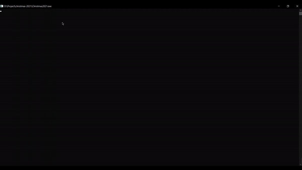
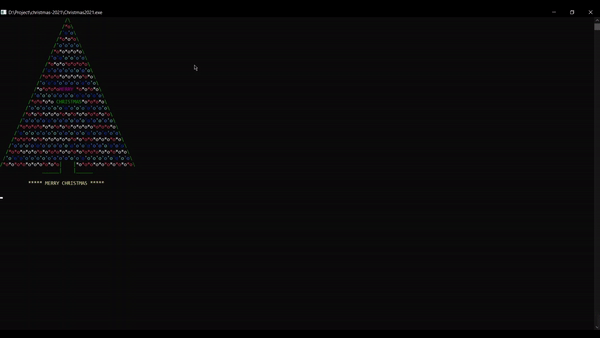

# CHRISTMAS 2021
:snowflake: :evergreen_tree: :musical_note: A Program for Christmas Tree and Christmas Song :musical_note: :snowman_with_snow: :snowflake: 

:point_right: [Live Demo](https://youtu.be/STebjISMGCc) :point_left:	

## Preview Screenshot

</img> &nbsp;&nbsp; </img>

## Reference
- [Console Screen Buffers](https://docs.microsoft.com/en-us/windows/console/console-screen-buffers?redirectedfrom=MSDN#_win32_character_attributes)
- [Stackoverflow - C - Change text colour of single words in Console Application?](https://stackoverflow.com/questions/32622365/c-change-text-colour-of-single-words-in-console-application)
- [[Beep Music in C/C++] Code merry christmas | NOEL BEEP SONG](https://www.youtube.com/watch?v=J7ohcZuiz1s)
- [Stackoverflow - C++ Win32 Console Color](https://stackoverflow.com/questions/17125440/c-win32-console-color/17125539)
- [C For Dummies Blog - The delay() Function](https://c-for-dummies.com/blog/?p=69)

## License & Copyright
&copy; 2021 Tien Huynh tienhuynh-tn Licensed under the [MIT LICENSE](https://github.com/tienhuynh-tn/christmas-2021/blob/main/LICENSE).

> :love_you_gesture: Feel free to use my repository and star it if you find something interesting :love_you_gesture:
